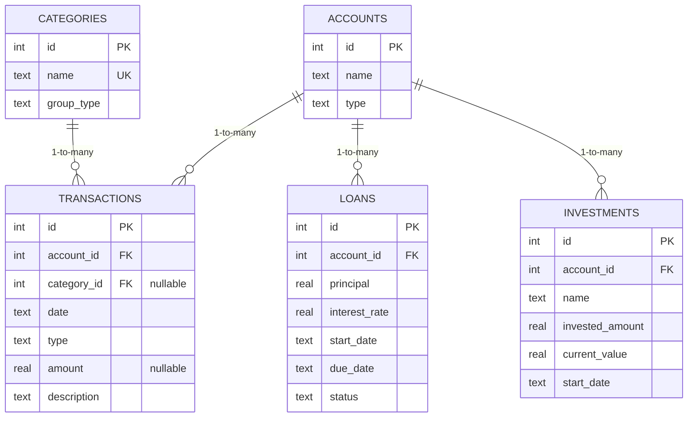

# ER Diagram — Financial Database Schema

Rendered version: [`er_diagram.png`](./er_diagram.png) (made with Graphviz from [`er_diagram.dot`](./er_diagram.dot)).

GitHub renders the Mermaid version below directly on the repo page, no extra tool needed:

**Relationships (all one-to-many):**
- `accounts (1) → (many) transactions` — one account has many transactions
- `categories (1) → (many) transactions` — one category labels many transactions
- `accounts (1) → (many) loans` — one account can have many loans
- `accounts (1) → (many) investments` — one account can have many investments

No many-to-many relationship exists yet in this schema (that's why there's no junction table) — `investment_categories` from Learn 2.5 was practiced separately in `practice/ex04_relationships.sql` but not added to the main schema, since no current entity actually needs a many-to-many link.
