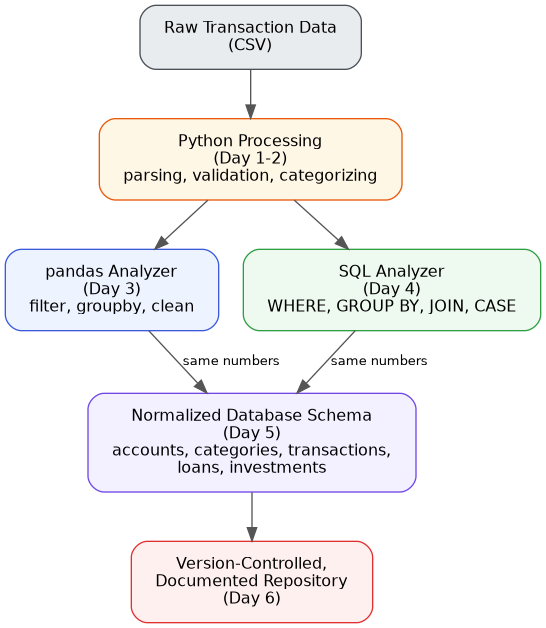

# Week 1 Review — Python → Data → Engineering Foundations

> Day 7/30 — 30 Days of Software Engineering + Data + AI + Business Analytics
> by [Mithun Chandra Dutta](https://github.com/mithunchandradutta)

## Overview

Day 7 is a no-new-code day. This folder is the honest checkpoint: did
everything from Day 1–6 actually work end-to-end, do the numbers agree
across tools, and — most importantly — what's still not fully understood.

## What I built (Day 1–6 summary)

```
Raw Transaction Data (CSV)
        |
Python Processing (Day 1-2)
        |
     +--+--+
     |     |
  pandas   SQL
 (Day 3)  (Day 4)
     |     |
     +--+--+
        |
Normalized Database Schema (Day 5)
        |
Version-Controlled, Documented Repository (Day 6)
```

Full write-up: [`summary/week1-recap.md`](./summary/week1-recap.md)

## Architecture Diagram



Source: [`summary/architecture-diagram.dot`](./summary/architecture-diagram.dot)
(edit and regenerate with `dot -Tpng summary/architecture-diagram.dot -o summary/architecture-diagram.png`)

## What Broke / What I Understood

See [`summary/week1-recap.md`](./summary/week1-recap.md) — includes the
Day 3 (pandas) vs Day 4 (SQL) cross-check and the Day 3/4 (flat) vs Day 5
(normalized) migration check.

## What I Still Don't Understand

The honest, un-edited version — this is the real deliverable of Day 7:
[`summary/gap-list.md`](./summary/gap-list.md)

## Week 1 Project Links

| Day | Project | Link |
| --- | --- | --- |
| 1 | Python basics | [`links/day-01-repo-link.txt`](./links/day-01-repo-link.txt) |
| 2 | Transaction Processor | [`links/day-02-repo-link.txt`](./links/day-02-repo-link.txt) |
| 3 | pandas Analyzer | [`links/day-03-repo-link.txt`](./links/day-03-repo-link.txt) |
| 4 | SQL Analyzer | [`links/day-04-repo-link.txt`](./links/day-04-repo-link.txt) |
| 5 | Database Schema | [`links/day-05-repo-link.txt`](./links/day-05-repo-link.txt) |
| 6 | Git Workflow | [`links/day-06-repo-link.txt`](./links/day-06-repo-link.txt) |

## Week 2 Plan

Driven directly by the gap list above — whatever's still unclear becomes
the first thing studied, not a new unrelated topic.

`[✏️ Week 2 direction — e.g. APIs, automation, deeper AI/data topics]`
