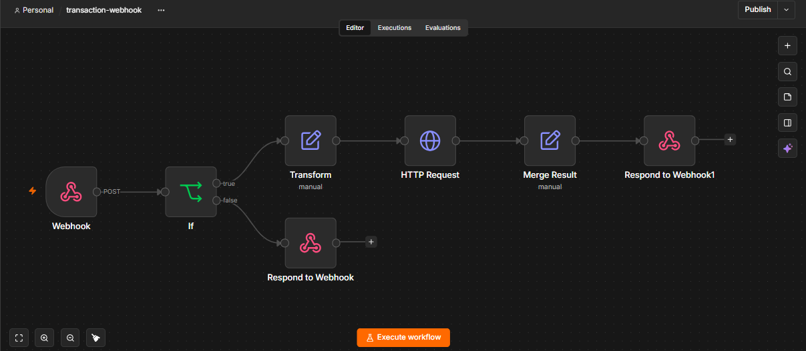
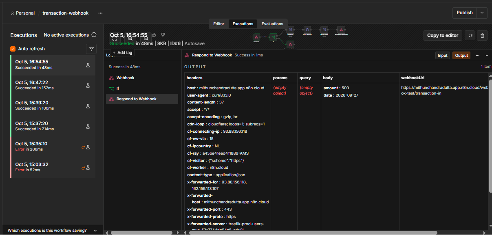
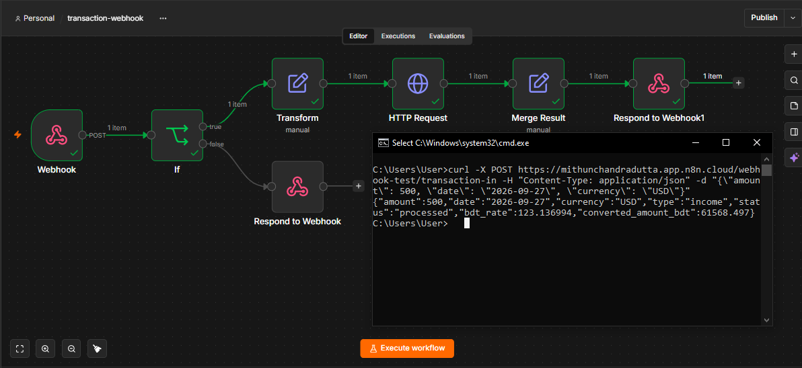
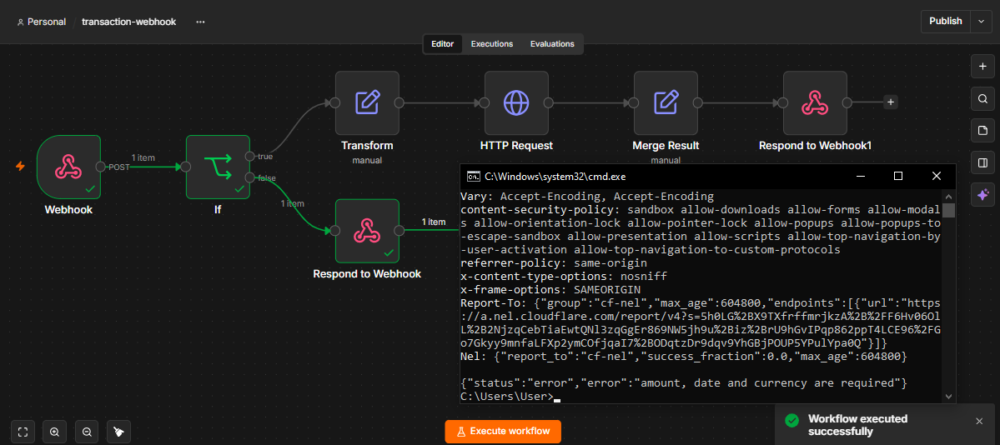

# n8n First Workflow

> Day 10/30 of my build-in-public journey: rebuilding my Day 8–9 Python pipeline (receive → validate → transform → call API → return) as a visual n8n workflow.

## Overview

A webhook-triggered n8n workflow that acts like a mini API. It receives a transaction as JSON, validates the required fields, transforms the data, calls an external exchange-rate API, and returns the enriched result.

- **Valid request** → `200 OK` with the transaction plus the BDT conversion
- **Invalid request** (missing field) → `400 Bad Request` with an error message

This is the visual version of the Python `extract → transform → load` logic from Day 8–9. The goal was to understand where a visual automation tool is enough and where hand-written code is still needed.

## Workflow Diagram



```
Webhook (POST /transaction-in)
        ↓
IF: amount, date, currency present?
   ↓ NO                    ↓ YES
Respond to Webhook (400)   Transform (Edit Fields)
                                ↓
                           HTTP Request (exchange rate API)
                                ↓
                           Merge Result (Edit Fields)
                                ↓
                           Respond to Webhook (200)
```

<!-- Optional: uncomment after adding these screenshots



-->

## Nodes Used & Why

| # | Node | Purpose | Python equivalent |
|---|------|---------|-------------------|
| 1 | **Webhook** | Trigger. `POST /transaction-in`, responds via a Respond to Webhook node | A Flask/FastAPI route |
| 2 | **If** | Checks that `amount`, `date` and `currency` are not empty (AND) | `if not all([...])` validation |
| 3 | **Edit Fields (`Transform`)** | Cleans fields and derives `type` (income/expense) | `transform()` function |
| 4 | **HTTP Request** | `GET https://open.er-api.com/v6/latest/{{ $json.currency }}` | `requests.get()` |
| 5 | **Edit Fields (`Merge Result`)** | Combines the original transaction with the API rate and computes `converted_amount_bdt` | Merging dicts |
| 6 | **Respond to Webhook** (x2) | Returns `400` on the invalid branch and `200` with final JSON on the success branch | `return jsonify(...), status` |

### Key expressions

```
{{ Number($json.body.amount) }}
{{ Number($json.body.amount) > 0 ? "income" : "expense" }}
{{ $json.rates.BDT }}
{{ $('Transform').item.json.amount * $json.rates.BDT }}
```

## Test Cases

| # | Test | Input | Expected | Result |
|---|------|-------|----------|--------|
| 1 | Valid webhook call | `{"amount": 500, "date": "2026-09-27", "currency": "USD"}` | 200 + enriched JSON | Passed |
| 2 | Missing field | `{"amount": 500, "date": "2026-09-27"}` | 400 via IF false branch | Passed |
| 3 | Expression correctness | `amount: 500` | `type: "income"` | Passed |
| 4 | Execution history | One failed run, then successful runs | Every run traceable with node input/output | Passed |
| 5 | External API failure | HTTP Request target unreachable | Error visible, no silent hang | Not tested yet (see Future Improvements) |

### Sample valid response

```json
{
  "amount": 500,
  "date": "2026-09-27",
  "currency": "USD",
  "type": "income",
  "status": "processed",
  "bdt_rate": 123.136994,
  "converted_amount_bdt": 61568.497
}
```

### Sample invalid response

```json
{
  "status": "error",
  "error": "amount, date and currency are required"
}
```

Sample request bodies are in [`test-requests/`](test-requests/).

## Technologies

- n8n Cloud
- Webhook / HTTP Request / If / Edit Fields / Respond to Webhook nodes
- [open.er-api.com](https://open.er-api.com) (free exchange-rate API, no key needed)
- curl (Windows cmd) for testing
- Git & GitHub

## How to Import & Run

1. In n8n, create a new workflow, then **⋯ → Import from file** and select `workflows/transaction-webhook.json`.
2. Open the **Webhook** node and copy the **Test URL**.
3. Click **Execute workflow** (the webhook only listens for one call in test mode).
4. Immediately send a request.

**Valid request (Windows cmd):**
```
curl -X POST <YOUR_TEST_URL> -H "Content-Type: application/json" -d "{\"amount\": 500, \"date\": \"2026-09-27\", \"currency\": \"USD\"}"
```

**Invalid request (missing currency):**
```
curl -i -X POST <YOUR_TEST_URL> -H "Content-Type: application/json" -d "{\"amount\": 500, \"date\": \"2026-09-27\"}"
```

Replace `<YOUR_TEST_URL>` with your own `https://<your-instance>.app.n8n.cloud/webhook-test/transaction-in`. Publish/activate the workflow to use the production URL (`/webhook/transaction-in`) instead.

## Debug Log

| Bug / Problem | Cause | Solution | Learning |
|---------------|-------|----------|----------|
| `404 webhook "transaction-in" is not registered` | Webhook was not listening; test URLs work for one call only | Click Execute workflow, then send curl immediately | Test mode and production mode are different |
| `No Respond to Webhook node found in the workflow` | Webhook was set to respond via a Respond node that did not exist yet | Added Respond to Webhook nodes | The response mode must match the nodes in the workflow |
| If node: `'500' is a number but was expecting a string` | Number field checked with a String operator, Convert types was off | Turned on "Convert types where required" | JSON types must match the operator type |
| `[ERROR: No path back to node]` in `Transform` | Merge fields were placed in the Transform node, which referenced itself | Moved them into a separate `Merge Result` node | `$('NodeName')` can only reference an earlier node |
| Fields not found when using `$json.amount` | Webhook wraps the request, so data is under `body` | Used `$json.body.amount` | Always inspect the real payload shape first |

## What I Learned

- A workflow is a graph of nodes, and each node's output becomes the next node's input, the same idea as an ETL pipeline.
- A webhook turns n8n into a small API that other systems can call.
- Expressions (`{{ }}`) let a node read any earlier output.
- Execution history keeps every run's input and output, which makes debugging more traceable than print statements.
- n8n is a hybrid tool: visual nodes cover most of the repetitive glue work, and a Code node covers custom logic.
- n8n replaces boilerplate, not thinking.

## Future Improvements

- Handle **external API failure**: set the HTTP Request node to "Continue (using error output)" and return a `502` response.
- Replace the IF check with a **Code node** for stricter validation (numeric amount, date format).
- **Store** each processed transaction (for example in Google Sheets) instead of only returning it.
- Add **webhook authentication** (header token) and use n8n Credentials for any secret.
- Publish the workflow and use the production URL.
- Prevent **duplicate submissions** with a transaction ID (planned for Day 11).

## Author

Mithun Chandra Dutta, CSE student building in public: Software Engineering + Data + AI + Automation.